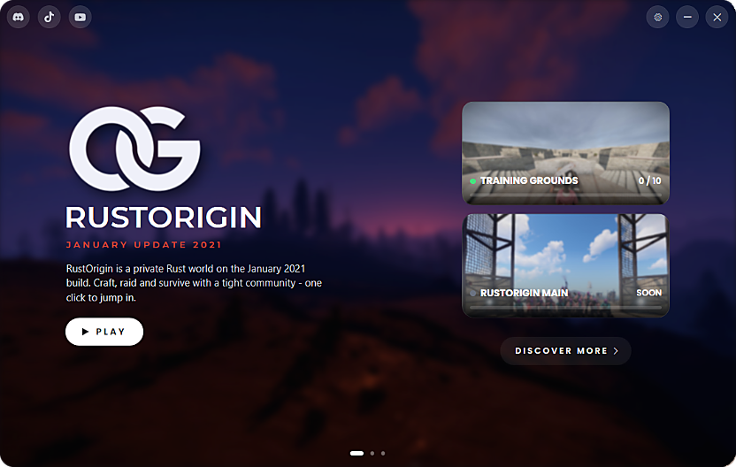

# RustOriginLauncher

A refined, native Windows launcher with a **cross-fading screenshot background** and the OG
brand mark. It downloads the RUSTORIGIN client from a URL you host, then launches it. The launcher
is a **single self-contained `RustOriginLauncher.exe`** (the background screenshots, logo, fonts and
`launcher.cfg` are embedded), not the full 16 GB client. See **Releases** below.

Built with WPF against .NET Framework 4.x, so it runs on any Windows 10/11 with **no
runtime install**. The background is a slideshow of three night screenshots that switch every ~7 seconds;
if none load, the launcher shows a dark gradient backdrop instead and keeps working.



## Files (ship the first three together)

| File | Purpose |
|------|---------|
| `RustOriginLauncher.exe` | The launcher (already built). |
| `assets/1.jpg`-`3.jpg` | The three night background screenshots (cross-fading slideshow). Swap them and rebuild to change the background. |
| `logo.png` | The RUSTORIGIN OG monogram (your original PNG, transparent bg, tight-cropped). Shown top-left and as the hero logo; swap the file to change it - no rebuild needed. |
| `logo-original.png` | Untouched copy of the original 2000x1333 logo PNG, kept for reference. |
| `fonts\` | Bundled Montserrat brand font (4 weights + OFL license). Must ship next to the exe. |
| `launcher.cfg` | Config: download URL, install folder, exe, title, tagline. |
| `src/WpfLauncher.cs` | Source of the launcher (WPF). |
| `scripts/build.bat` | Dev compile check of `src/WpfLauncher.cs`. |
| `scripts/make_release.ps1` | Build the shippable single-file `RustOriginLauncher.exe`. |
| `scripts/package_client.ps1` | Zips your client folder into `RustClient.zip` for hosting. |

The repo is organized into `src/` (code), `assets/` (embedded media + fonts), `config/`
(`launcher.cfg`), `scripts/` (build/packaging), and `docs/`. The media, fonts, and
`launcher.cfg` above are embedded into the exe at build time - only `RustOriginLauncher.exe` ships.

## Typography

Brand text (hero title, wordmark, accent line, caps labels) uses **Montserrat** (SemiBold),
a geometric sans whose round O mirrors the OG mark. It's bundled in `fonts\` (SIL Open Font
License, included as `fonts\OFL.txt`) and loaded at runtime by family name - the launcher
falls back to Bahnschrift/Segoe UI if the folder is missing. Body text uses Segoe UI for
readability.

> **Building UI?** See the [**Styling Guide**](docs/STYLING.md) for the full palette, the
> `B()`/`Track()` helpers, the control factories, and the frameless-window conventions used
> throughout `src/WpfLauncher.cs`.

## The window (rounded + native, opens at 1440x860)

- **Rounded, frameless** window that still behaves like a normal Windows window - **drag it from anywhere**, resize, maximize, Aero Snap, taskbar and the system menu (via WPF `WindowChrome`), with custom **settings (gear) / minimize / close** buttons top-right (maximize via double-click or Aero Snap). Corners flatten when maximized. Full-bleed cross-fading screenshot slideshow behind it, with **carousel dot indicators** at the bottom (click a dot to jump to that screenshot).
- **Settings panel** (the gear button, top-right): toggle minimize-while-in-game, auto-update and Discord Rich Presence; open the log folder; re-import your Rust keybinds; or **uninstall the client** (deletes the game files, keeps the launcher). Styled like rustorigin.com. (The toggles are also editable in `prefs.cfg`; the background slideshow is always on.)
- **Top-left**: OG logo mark in a glass pill. **Left rail**: games / library / collections icons.
- **Top-right**: recent-games pill (star, thumbnails, link) + user pill (chat, bell, avatar,
  player name, now-playing) + minimize/close.
- **Hero**: "Most Played" tag -> large OG logo -> RUSTORIGIN wordmark -> red "JANUARY UPDATE 2021"
  -> description -> white **PLAY** pill + **INSTALL/UPDATE** link, with a live download/extract
  progress bar.
- **Right column**: a vertical stack of **website-style server cards** (like rustorigin.com) - a cover
  image header with an ONLINE/SOON status badge and a tag chip, a **PLAYERS ONLINE** count with a violet
  progress bar, the name + subtitle, the connect address, and a violet **CONNECT** chip. Clicking a card
  launches the client with that server's args. When a card's args include `+connect HOST:PORT` the count,
  bar and dot go **live** over Steam A2S (refreshed every ~60s). "DISCOVER MORE" below.
- **Friends rail** with 8 avatars and online/offline dots. Bottom chevron + chat icon.
- Icons use **Segoe MDL2 Assets** (built into Windows 10/11 - nothing to bundle).

## One-time setup (you, the host)

1. **Zip the client** - from PowerShell in this folder:
   ```powershell
   .\scripts\package_client.ps1
   ```
   Produces `RustClient.zip` (client files at the zip root). Default level is `Optimal`
   (smaller download); use `-Level Fastest` for speed, or point `-SourceDir` / `-OutFile`
   elsewhere. The script **automatically excludes** anything that must never ship, even if
   the game recreated it after a test launch: `temp\`, `maps\`, everything in `cfg\`
   except `keys_default.cfg`, and junk like `*.bak`, `*.py`, `*.vdf`, `*.bat`, `*.before*`.

2. **Upload `RustClient.zip`** to any host that gives a **direct download link**
   (your web server, an S3/Cloudflare R2 bucket, etc.). The link must download the file
   directly, not open a preview page.

3. **Set the URL** in `launcher.cfg`:
   ```
   DownloadUrl=https://your-host/RustClient.zip
   ```

4. **Ship** the release exe built by `scripts/make_release.ps1` (see **Releases** below).

## Downloads: resumable + verified + TLS 1.2

- The launcher forces **TLS 1.2** (and 1.3 where Windows supports it), so HTTPS hosts like
  Cloudflare R2 work on every machine.
- **SHA-256 verification (required):** the finished download is hashed and **rejected** (deleted,
  never extracted or launched) unless it matches `Sha256=` in `launcher.cfg`. Verification is
  mandatory - if `Sha256=` is blank, **Install is blocked** and nothing is downloaded, so the
  launcher never installs a client it can't verify. The check runs on the completed file *before*
  extraction; on mismatch the partial is cleared so the next attempt re-downloads cleanly.
  `scripts/package_client.ps1` prints the hash to paste in, and also writes a `RustClient.zip.sha256` sidecar.
- Downloads are **resumable**: the file is written to
  `%LOCALAPPDATA%\RUSTORIGIN\RustClient.zip.part` using HTTP Range requests. A dropped
  connection retries automatically (up to 30 times, 5 s apart) from the last byte received.
  Closing the launcher mid-download keeps the partial file - the button turns into
  **RESUME** on the next start. A saved partial is only reused for the *same* remote file
  (URL + ETag + size), so a new build never gets stitched onto an old partial.
- Every download step is logged with timestamps to `%LOCALAPPDATA%\RUSTORIGIN\launcher.log`
  - ask players for this file if an install misbehaves.
- **Keeps your keybinds:** after the first install, if you already own Rust on Steam, the launcher
  offers (once) to copy your existing `...\steamapps\common\Rust\cfg` into RustOrigin so your
  keybinds carry over. Graphics/quality settings don't carry - this build has its own, set them
  in-game.

## What players do

1. Run `RustOriginLauncher.exe`.
2. Click **Install** - it downloads the zip (live progress + speed, resumable) and extracts it to
   `C:\RUSTORIGIN` (the `InstallDir` set in `launcher.cfg`).
3. If you already have Rust on Steam, say **Yes** to the one-time prompt to import your keybinds.
4. Click **PLAY** - launches `RustClient.exe`.

Clicking **Install** again re-downloads and overwrites = updates.

## launcher.cfg reference

| Key | Meaning |
|-----|---------|
| `DownloadUrl` | Direct link to `RustClient.zip`. Required. |
| `Sha256` | Expected SHA-256 of `RustClient.zip`. **Required** - downloads are verified (mismatch = rejected) and Install is blocked when blank. From `scripts/package_client.ps1` or `certutil -hashfile RustClient.zip SHA256`. |
| `InstallDir` | Install path. Shipped as `C:\RUSTORIGIN` (visible, no admin rights needed). Blank = `.\Rust` next to the launcher. |
| `LaunchExe` | Exe the Play button runs (searched inside the install folder). Default `RustClient.exe`. |
| `LaunchArgs` | Optional args for the main PLAY button, e.g. `-console +connect 127.0.0.1:28015`. |
| `Version` | Optional label shown in the launcher. |
| `Title` | Big hero title (default `RUSTORIGIN`). |
| `Tagline` | Description line under the title. |
| `Player` | Name shown in the top-right user pill. |
| `UpdateRepo` | `owner/repo` for launcher self-updates via GitHub Releases (public repos only; blank disables). The launcher checks on launch, and only installs an update that matches the release's `SHA256SUMS.txt`. |
| `DiscordAppId` | Discord application id to enable **Rich Presence** ("RUSTORIGIN - In the launcher / In game" on the player's Discord). Create an app at discord.com/developers, paste its Application ID. Blank disables. |
| `DiscordLargeImage` | Optional Rich Presence art-asset key (uploaded in the Discord app) shown as the large image. |
| `DiscordButtonLabel` / `DiscordButtonUrl` | Optional clickable button under the presence, e.g. `Play on RustOrigin` linking to `https://rustorigin.com`. |
| `Server` | Repeatable, up to 6: `Server=Tag\|Name\|launch args\|players\|cover` (everything after Name optional). `cover` is an embedded image file name (e.g. `main.jpg`) used as the card background. Cards stack vertically; the first is the "now playing" entry. If the launch args contain `+connect HOST:PORT`, the card shows a **live** A2S player count instead of the static `players` value. |
| `Social` | Repeatable: `Social=platform\|url` - a clickable brand icon in the bar above the server cards that opens the URL. Built-in icons: `discord`, `youtube`, `tiktok`. |

## Notes

- The launcher targets .NET Framework 4.x, which ships with every Windows 10/11 - no
  runtime install needed on players' machines.
- **EasyAntiCheat:** this build's `win_installscript.vdf` shows the client normally runs
  `EasyAntiCheat\EasyAntiCheat_Setup.exe install 12 -console` at install time. Since the
  launcher just unzips files, EAC is not auto-installed. If your setup needs it, either
  set `LaunchArgs` / a small step to run it, or have players run
  `EasyAntiCheat\EasyAntiCheat_Setup.exe` once. (Many private-server builds run EAC-less -
  skip this if yours does.)
- To rebuild after editing `src/WpfLauncher.cs`, run `scripts\build.bat` (dev check) or
  `scripts\make_release.ps1` (shippable single-file exe). Follow the
  [Styling Guide](docs/STYLING.md) when adding or changing UI.

## Releases (what players download)

The launcher ships as a **single file**: `RustOriginLauncher.exe` (~3 MB). The night background
screenshots, logo, Montserrat fonts (+ OFL license) and the default `launcher.cfg` are embedded
as resources and unpacked at first run to `%LOCALAPPDATA%\RUSTORIGIN\assets\<version>\`. Nothing
else needs to sit next to the exe.

```powershell
.\scripts\make_release.ps1 -Version 1.0.0     # -> release\RustOriginLauncher.exe
```

The script stamps the version into the exe, embeds the current `launcher.cfg`, `logo.png`,
the `assets\1.jpg`-`3.jpg` night screenshots and `fonts\`, and applies the app icon (`release_icon.ico`) and manifest.
To change the embedded defaults (servers, download URL, install dir), edit `launcher.cfg`
here and rebuild. A `launcher.cfg` placed **next to the exe** overrides the embedded one at
runtime (handy for a test server) - a file that defines `Server=` lines replaces the list.

Hosted in the R2 bucket next to the client:
`https://pub-d8992e85a2df42be8ca5d1757ce64cd8.r2.dev/RustOriginLauncher.exe`
Publish a new build with
`rclone copyto release\RustOriginLauncher.exe r2:rustorigin/RustOriginLauncher.exe --s3-no-check-bucket`.

Before publishing, set real `Server=` lines (IP:port of your servers) and `Player=` in
`launcher.cfg`. The exe is **unsigned** until a code-signing certificate is added, so
SmartScreen shows "Windows protected your PC" on first run (*More info -> Run anyway*).
